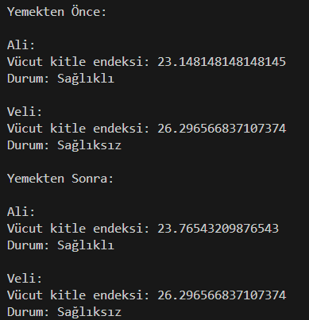
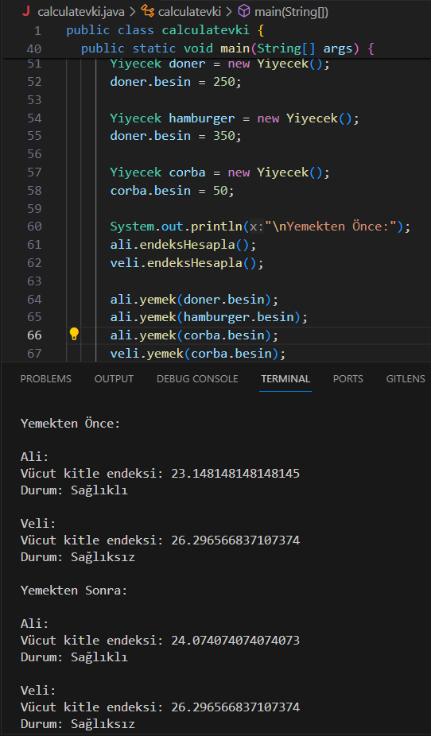

**EN:**
**This is a calculator that calculates the height and weight values ​​of human objects along with their body mass indexes. Also, it determines whether the mass index is healthy or unhealthy.**

**The "Yemek" function is added to test human objects' weight variables by changing them.**

**The calculation formula is based on the formula that is being actually used irl.**

  

TR:
İnsan objelerinin boy ve kilo değerleri ile vücut kitle endekslerini hesaplayan bir hesap makinesi. Ayrıca kitle endeksinin sağlıklı veya sağlıksız olduğu da belirlenmektedir.

Yemek foksiyonu ise insan objelerin kilo değişkenlerini değiştirerek test etmek için eklenmiştir.

Hesaplama formülü gerçekte kullanılan formüle dayanmaktadır.\

   

\

